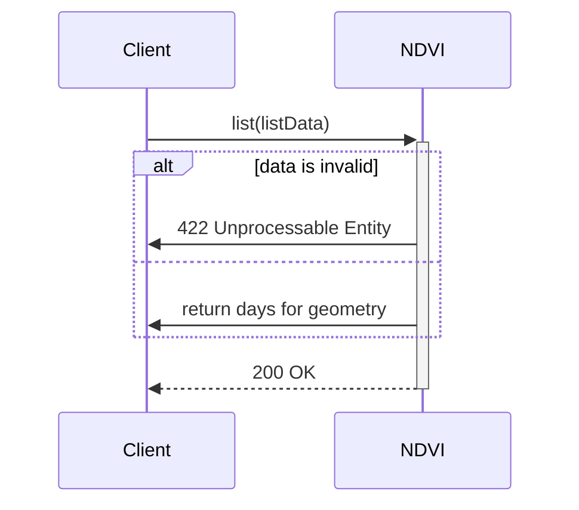
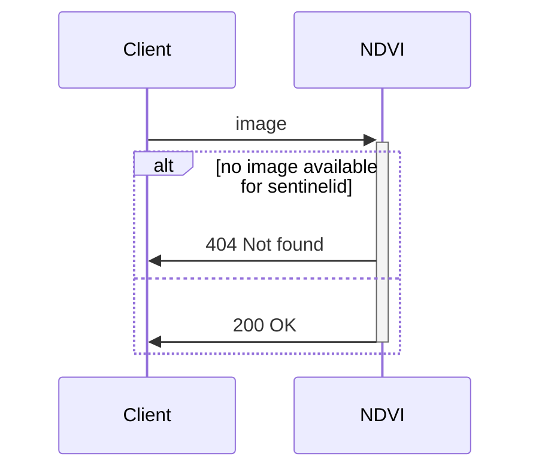

# Introduction
RESTful interface for getting NDVI-images and related data from Sentinel Hub.

* list which days have images available for given geometry
* get images for given days and geometries

NDVI service needs to be able to process requests for getting the dates with images for given geometries and for getting the images for given dates and geometries.

# Use Cases

## List
***


List the days with found images for the given geometry found in Sentinel Hub. Service should store the given geometry and the days in which the images can be found so that there would be no need to re-query the days (only newer days from the last query should be queried) every time from Sentinel Hub. If the image is available for given day then the service should assign unique id "sentinelid" for that day and image.


| Endpoint Url      | HTTP Method |
| ----------------- | ----------- |
| /ndvi/api/v1/list | POST        |


**Request**

| Name         | Type                                   | Description                                                |
|--------------|----------------------------------------|-------------------------------------------------------------|
| geometry     | geoJSON                                | Geometry in geoJSON format, coordinate reference system WGS84 (EPSG:4326) |
| start_date   | dateString (ISO 8601) | The start date to include images from                      |
| end_date     | dateString (ISO 8601) | The end date to include images to                          |


```
Request body
{   
	"geometry": "geoJSON",
	"start_date": "dateString",
	"end_date": "dateString"
}
```

**Response**

| Name           | Type                                   | Description                                           |
|----------------|----------------------------------------|-------------------------------------------------------|
|                | array                                  | All the days from which images can be queried          |
| generationtime | dateString (ISO 8601) | The date of the image                                 |
| sentinelid     | string                 | generationtime and geometry converted to sha256-format, generated for the request to be used when fetching the image from database e.g. 2023-05-30T00:00:00Z_c7a5478757abfae7286751b0950e58991fa3f6ef77f77e844baba038cb86b647|


<div class="code-block">
```json 
[
  {
    "generationtime": "2023-05-15T00:00:00Z",
    "sentinelid": "2023-05-15T00:00:00Z_c7a5478757abfae7286751b0950e58991fa3f6ef77f77e844baba..."
  },
  {
    "generationtime": "2023-05-30T00:00:00Z",
    "sentinelid": "2023-05-30T00:00:00Z_c7a5478757abfae7286751b0950e58991fa3f6ef77f77e844baba..."
  },
  // ...
]
```
</div>

**Sequence diagram**




## Image
***
Returns the NDVI image for the given sentinelid.

| Endpoint Url            | HTTP Method |
|-------------------------|-------------|
| /ndvi/api/v1/image/     | GET         |


**Request**

| Name         | Type                                   | Description                                                |
|--------------|----------------------------------------|------------------------------------------------------------|
| sentinelid   | string                                 |  id for image (generated when image with related data fetched from sentinelhub and saved into database) |
| epsg         | integer |  optional, used when related coordinates need to be in system EPSG:3067


**Response**

| Name            | Type           | Description                                           |
|-----------------|----------------|-------------------------------------------------------|
| average         | float          | Average value of the NDVI                             |
| max             | float          | Maximum value of the NDVI                             |
| min             | float          | Minimum value of the NDVI                             |
| image           |                | Image of the NDVI                                     |
| image.minX      | float          | Bounding rect minimum X value, coordinate reference system WGS84 (EPSG:4326) |
| image.minY      | float          | Bounding rect minimum Y value, coordinate reference system WGS84 (EPSG:4326) |
| image.maxX      | float          | Bounding rect maximum X value, coordinate reference system WGS84 (EPSG:4326) |
| image.maxY      | float          | Bounding rect maximum Y value, coordinate reference system WGS84 (EPSG:4326) |
| image.dataUrl   | Base&4 string  | Image in Base64 string format (i.e., data:image/png;base64...)   |
| scale           | array          | Array for NDVI value categories as colours            |
| scale.color     | string         | Colour as RGB string value                            |
| scale.amount    | integer        |                                                       |
| scale.from      | float          |                                                       |


**Response datatypes**

```json
{
	"average": "float",
	"max": "float",
	"min": "float",
	"image": {
		"minX": "float",
		"minY": "float",
		"maxX": "float",
		"maxY": "float",
		"dataUrl": "Base64 string"
	},
	"scale": [
		{
			"color": "string",
			"amount": "integer",
			"from": "float"
		},
		{
			"color": "string",
			"amount": "integer",
			"from": "float"
		},
		{
			"color": "string",
			"amount": "integer",
			"from": "float"
		},
		{
			"color": "string",
			"amount": "integer",
			"from": "float"
		}
	]
}
```

**Example**

```json
{
	"average": 0.5657129907618343,
	"max": 0.75,
	"min": 0.15,
	"image": {
		"minX": 26.1930913,
		"minY": 62.9857763,
		"maxX": 26.194766,
		"maxY": 62.9867615
		"dataUrl": "data:image/png;base64,iVBORw0KGgoAAAANSUhEUgAAAFoAAABuCAYAAACnQwS5AAADnEl..."
	},
	"scale": [
		{
			"color": "rgb(244, 67, 54)",
			"amount": 0,
			"from": 0.15
		},
		{
			"color": "rgb(255, 152, 0)",
			"amount": 0,
			"from": 0.3
		},
		{
			"color": "rgb(255, 235, 59)",
			"amount": 22,
			"from": 0.45
		},
		{
			"color": "rgb(76, 175, 80)",
			"amount": 78,
			"from": 0.6
		}
	]
}
```

**Sequence diagram**


MARK:notice::: in case of 404 there is sometring error situation on front end or database is corrupted. Will happen very rarely or never but in testinf/developing situations.  

## Activate
***
esimerkki lisää jokin peltosetti, at the beginnig there no data at all for a specifig time range,
so all the data have to be prosessed and fetched/requested from sentinelhub 
When activate with AOIs so it will be known later which geometries NDI data need to be updated data form upcoming dates
24h cron ja tämä vain kasvukauden aikana päiivttää koko kantaa ja peltosetit ovat sopiva määrä kerrall muuten tulee mahd. sanomista too many  requests

TESTATTAVA useaa samaiakaista toimeksiantoa RiSKI jos resurssit eivät riitä erillinen kappale SWOT tai järkevämpi ottaa geometriat taleteen ja aja ne  

## Status of activation
***
If tou have large set of fields it will take more time for totally new data time period range
## Dev
***
Demo kannan testaukseen ja ylläpitoon erillinen route voidaan helposti ottaa mukaan tästähän on esimerkki 
tämä on Mongo joka tapauksessa, json-tiedosto, jossa geometriat -> mongoon
CRUD tosin tässä tapauksessa ei ole Updatea PUT UPDATE MUTTA UPDATE tai PUT on kun 
## User
***
#### authetication  tulisiko peltotilkutkin listana!!!!