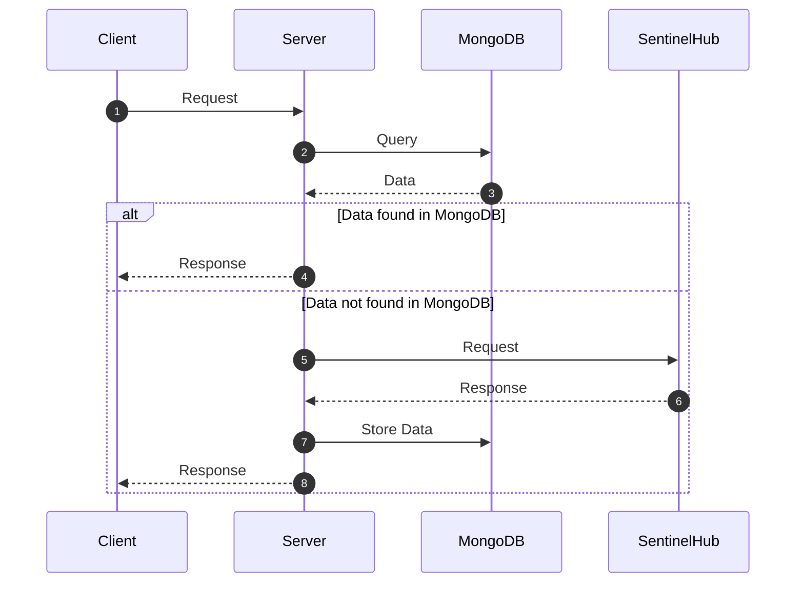
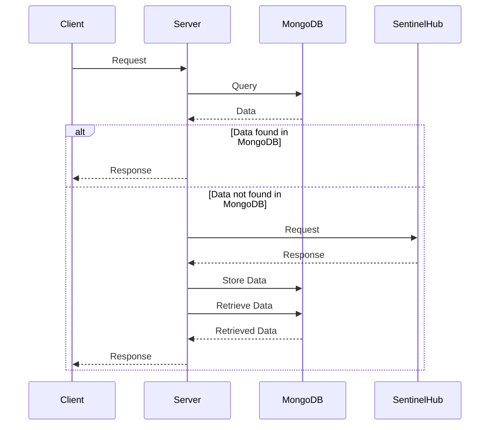
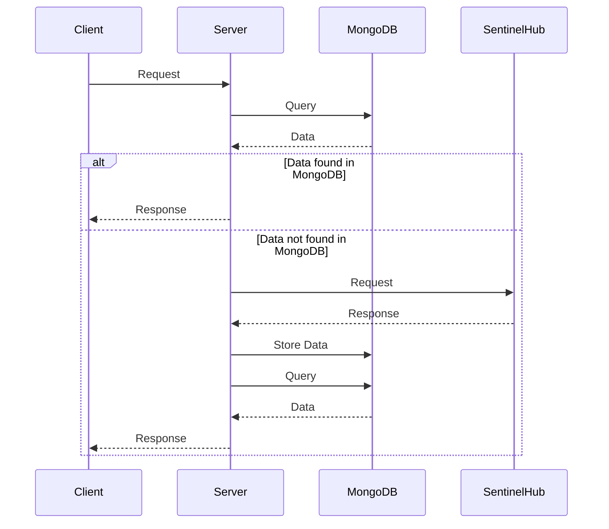
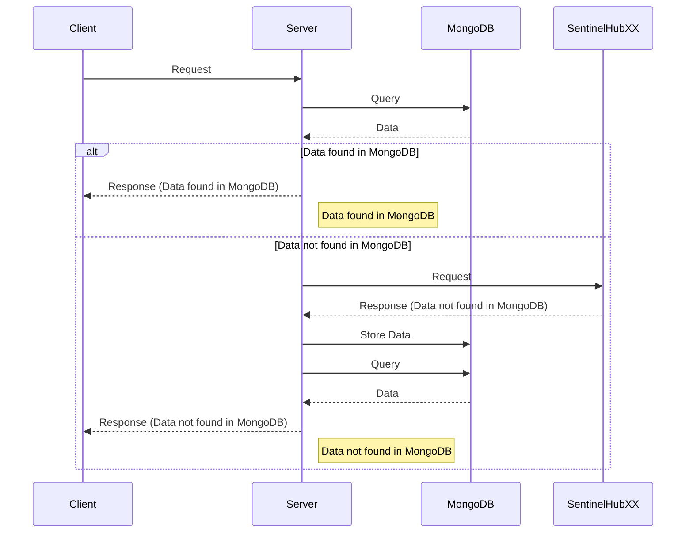
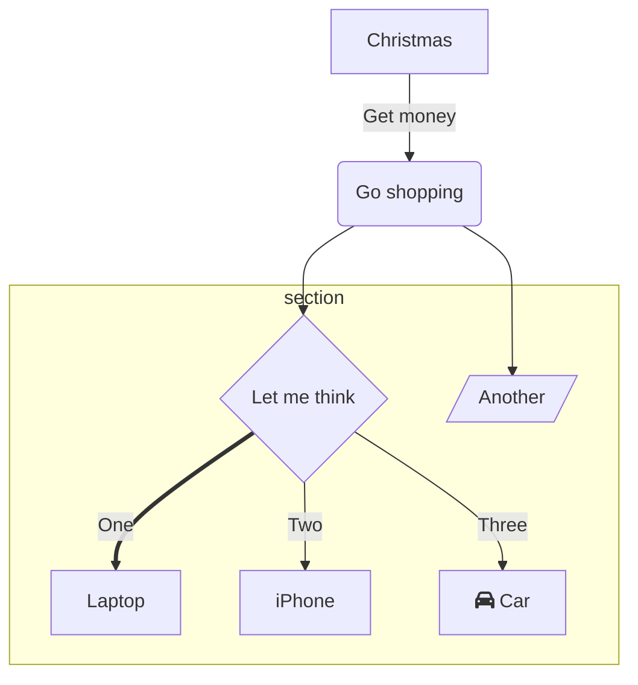
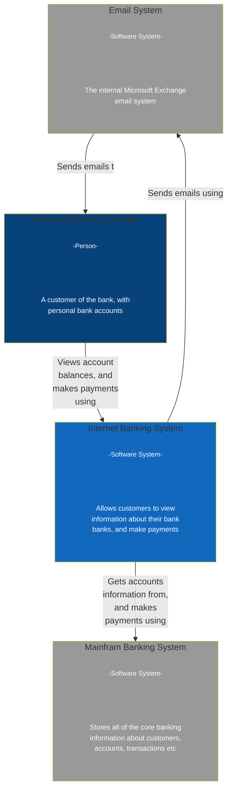
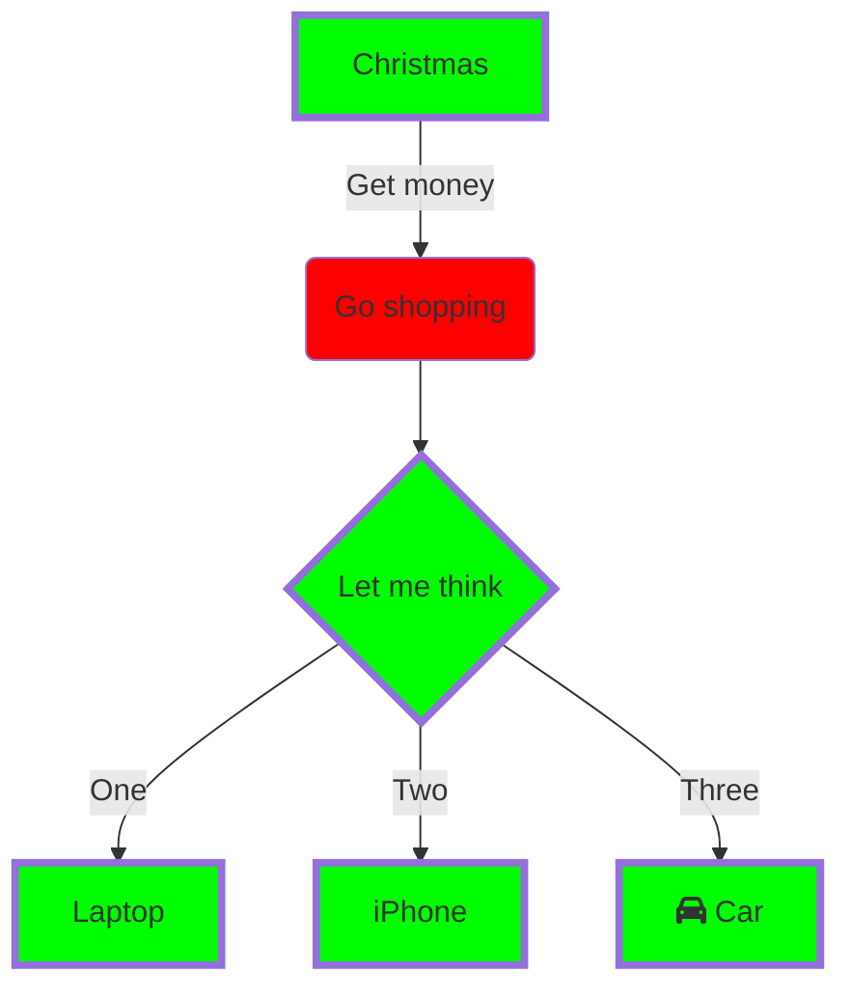
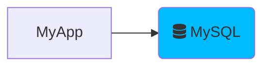

Muuten ok mutta response clientille kun storen jälkeen haetaan uudelleen mongosta
Tosin jos geometrille ei ole kuvia response list ei toimi

Participants:

Client: The entity initiating the request.
Server: The central processing entity that handles client requests, communicates with MongoDB, and interacts with SentinelHub.
MongoDB: The database used to store and retrieve data.
SentinelHub: An external service from which the server can request data.
Sequence of Interactions:

The "Client" sends a "Request" to the "Server."
The "Server" checks if the required data is available in "MongoDB" by sending a "Query" to it.
If the data is found in "MongoDB," it responds directly to the "Client" with a "Response."
If the data is not found in "MongoDB" after receiving a response from "SentinelHub," the "Server" stores the data in "MongoDB."
The "Server" then retrieves the data from "MongoDB."
Finally, the "Server" responds to the "Client" with the retrieved data.

:::

:::

:::

:::

