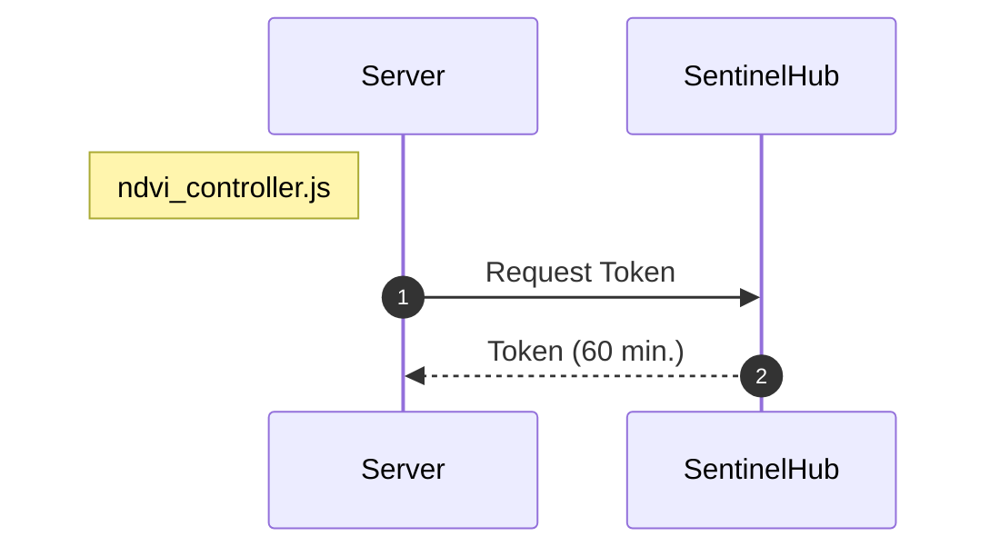

user (node/express-server) for sentinelhub service needs service plan with 

the values are stored into .env file
e.g.
```
sentinelHubClientId = "6c9c641b-cc70-4595-8007-360b09cd533a"
sentinelHubClientSecret = "88myeh2ksnUjQjcCMTL580HAkoifxYgR"
instanceId = "8c9fd4ff-f38d-42ef-aad2-0f0a2d0d7bfa"
```

in production env should be stored in secrets of the server





Point 1  
in **ndvi_controller.js** request for sentinelHub token
params: clientId, clientSecret

Point 2 token to global varaiable authToken

When request for token from sentinelhub it will be expired in 60 min, so it need to be refreshed actually asking for new so expiration need to be checked for a while on serverside code

on backend server code

request for token

```../utils/authenticate.js```

request for the time left for the expiration

```../utils/checkToken.js```

**var authToken** is holding the token to sentinelHub 
it is a global variable the scope just in the code of ndvi_cotroller.js

There is not sense to request token for every request but the status an left time will be asked Middleware checkstatus w
this may be the clearest and most solid simple way!!!! 

mainitse OAUTH2 token